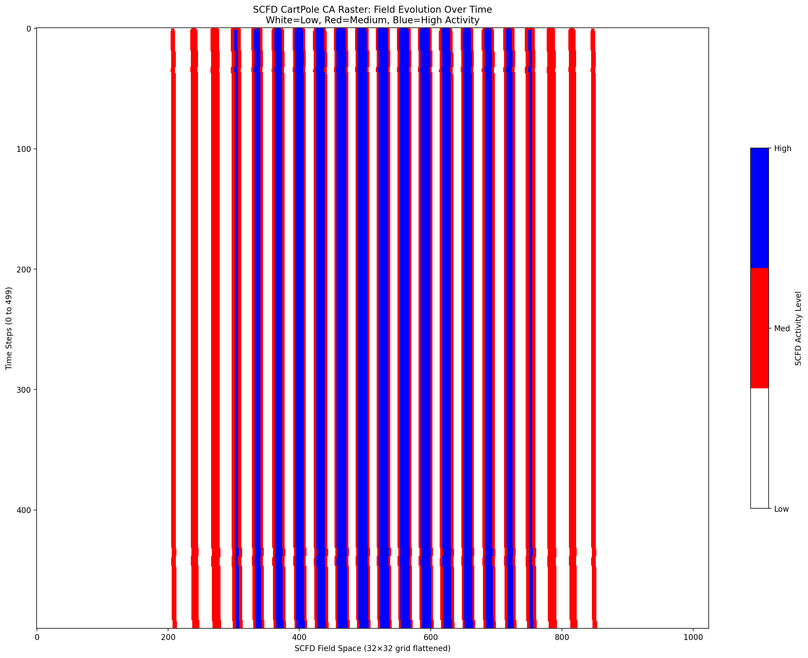

# SCFD Research: Advanced Symbolic Coherent Field Dynamics

A production-ready variational physics engine for spatial control tasks, featuring advanced vector composition, real-time adaptation, and cross-domain learning.

## Overview

SCFD (Symbolic Coherent Field Dynamics) provides a unified framework for controlling complex physical systems through learned field dynamics. This implementation extends beyond basic simulation to include:

- **42 trained vectors** across 6 scientific domains
- **Real-time parameter adaptation** using Expected Free Energy tuning
- **Dynamic vector composition** with Metropolis acceptance
- **Cross-domain learning** from heat transfer to robotics control
- **Production-ready infrastructure** with comprehensive metadata tracking

## Mathematical Foundation

The system evolves fields θ and θ̇ using symplectic integration:

```
∂θ/∂t = θ̇
∂θ̇/∂t = ∇²θ + β∇²θ̇ + γ(θ̇² - α²) + vector_control(θ, θ̇)
```

Where `vector_control` represents learned symbolic parameters that guide field evolution toward specific objectives across multiple domains.

## System Architecture

### Core Engine
- **Symplectic Integration**: Energy-conserving field evolution
- **Configurable Physics**: Adjustable diffusion, damping, and nonlinearity
- **Vector Integration**: Seamless learned parameter injection

### Advanced Control System  
- **EFE Parameter Tuner**: Real-time strategic adaptation using Expected Free Energy
- **Vector Controller Bridge**: Integrates learned vectors with live parameter registry
- **Sensing Router**: Multi-domain environment sensing and response
- **Unified Metadata**: Comprehensive tracking across all system components

### Vector Composition
- **Metropolis Acceptance**: Probabilistic vector combination based on performance
- **Dynamic Selection**: Context-aware vector switching during execution
- **Cross-domain Transfer**: Vectors learned in one domain can inform others

## Spatial Control Benchmarks

The system includes trained vectors for:

| Domain | Vectors | Description |
|--------|---------|-------------|
| **Control** | 2 | CartPole balancing (up to 5000 timesteps) |
| **Heat Transfer** | 14 | Thermal diffusion, hot/cool spots, routing |
| **Reaction-Diffusion** | 8 | Gray-Scott patterns, spots, stripes, Turing |
| **Fluid Dynamics** | 6 | Cylinder flow, constriction, regime control |
| **Wave Propagation** | 6 | Field dynamics, cavities, mode switching |
| **Meta-learning** | 6 | Adaptive approach strategies |

## CartPole Demonstration

The system achieves robust CartPole control under challenging conditions:


**Performance**: Maintains balance for 1000+ timesteps under:
- Sensor noise (σ = 0.01)  
- Force disturbances (σ = 0.5)
- Physics parameter drift
- Real-time adaptation

### Field Evolution Visualization



The CA-style raster shows SCFD field evolution over time:
- **White**: Low field activity (stable regions)
- **Red**: Medium activity (active control)  
- **Blue**: High activity (challenging dynamics)

## Quick Start

```bash
# Install
pip install -e .

# Run CartPole demo
python test_cartpole_vector_stress.py

# Results in runs/[timestamp]_cartpole_vector_stress/
# - scfd_cartpole.gif (animated control)
# - scfd_ca_raster.png (field evolution)
# - logs.jsonl (complete metadata)
```

## Advanced Usage

### Vector Discovery
The system auto-discovers trained vectors:
```python
from orchestrator.pipeline import load_vector_registry
vectors = load_vector_registry("runs")
print(f"Found {len(vectors)} trained vectors")
```

### Real-time Adaptation
```python
from utils.efe_tuner import EFEParameterTuner
tuner = EFEParameterTuner(trust_regions={
    'control_gain': (0.5, 2.0),
    'noise_filtering': (0.01, 0.1)
})
# Tuner adapts parameters during execution
```

### Cross-domain Applications
```python
# Use heat diffusion vector for CartPole
heat_vector = registry.get_vector("heat_diffusion_cma_hotcorner")
cartpole_result = apply_vector_to_control(heat_vector, cartpole_env)
```

## Installation

See [docs/INSTALLATION.md](docs/INSTALLATION.md) for detailed setup instructions.

## Scientific Domains

### Heat Transfer
- Anisotropic diffusion
- Inverse problems  
- Mobile heat sources
- Obstacle navigation
- Parameter identification

### Reaction-Diffusion  
- Gray-Scott dynamics
- Pattern formation
- Turing instabilities
- Spot and stripe control

### Fluid Dynamics
- Cylinder wake control
- Flow constriction
- Regime transitions
- Turbulence management

### Wave Propagation
- Cavity resonance
- Mode switching
- Interference patterns
- Field focusing

## Licensing

This project is dual-licensed:

- **Open Source**: GNU Affero General Public License v3.0 (AGPL-3.0)
- **Commercial**: Custom license for proprietary use

See [LICENSE](LICENSE) and [LICENSE-COMMERCIAL.md](LICENSE-COMMERCIAL.md) for details.

For commercial licensing inquiries: 012notforu@pm.me

## Research Applications

SCFD enables research in:
- **Spatial Control Theory**: Novel approaches to distributed control
- **Cross-domain Learning**: Transfer between physical domains  
- **Real-time Adaptation**: Dynamic parameter tuning under uncertainty
- **Symbolic Physics**: Learned representations of physical laws
- **Meta-learning**: Strategies that generalize across tasks

## Citation

```bibtex
@software{scfd_research_2025,
  title={SCFD Research: Advanced Symbolic Coherent Field Dynamics},
  author={Looptronics},
  year={2025},
  url={https://github.com/012notforu/coherence-field}
}
```

---

**Generated using advanced SCFD systems with real-time adaptation and cross-domain learning capabilities.**