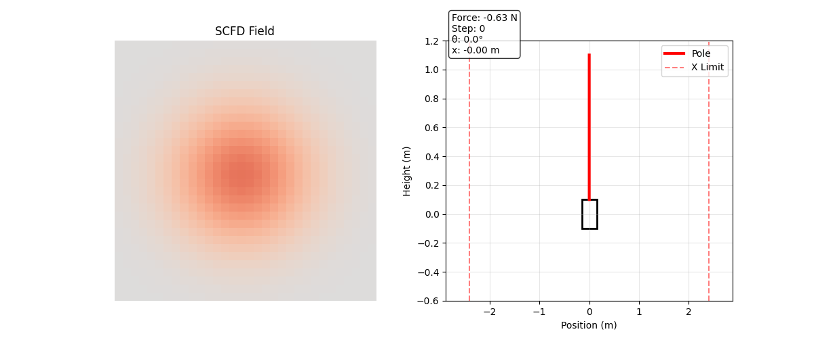
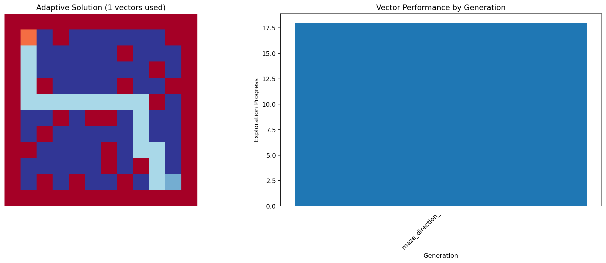

# SCFD Research


Symbolic Coherent Field Dynamics (SCFD) is a variational physics engine for spatial control tasks. This repository maintains the SCFD core, evolutionary controllers, and benchmark suite we use to explore coherence-preserving dynamics, inverse-gradient energies, probabilistic gating, and their interpretability. Early work was inspired by Lenia-style cellular automata, but this codebase is focused entirely on SCFD-driven controllers, diagnostics, and interpretability hooks across spatial control tasks.

SCFD encodes fields, enforces coherence, and exposes controllers that adjust parameters to maintain desired dynamics.


> **What's here-** A full SCFD + EM stack, a curated set of spatial control benchmarks, CMA-based vector search tooling, and orchestrator utilities for deploying learned vectors. If you want installation instructions or reproduction scripts, jump to [`docs/DIRECTIONS.md`](docs/DIRECTIONS.md).


## What's New Since coherence-field

- **Manifest-driven registry** - every trained controller (`runs/*/best_vector.json`) ships with a JSON manifest that advertises parameter ranges, domain tags, and selection predicates so the orchestrator can reason about suitability instead of relying on hard-coded IDs.
- **Context-aware planning** - `orchestrator/pipeline.probe_environment` captures task labels, obstacle densities, and failure modes and forwards them to the registry. The planner can therefore auto-select exploration / precision bundles for any grid-like task without per-environment hacks.
- **Vector bundling for grid navigation** - the adaptive solver blends metadata-aware vectors (coverage + precision) to solve grid navigation tasks. The image below shows the bundled controller solving a 12x12 grid navigation problem in a single generation.
- **CMA recipes + media assets** - reproducible scripts and ready-to-embed media for SCFD cart-pole and grid navigation demos (see the Media section below).
- **Neural interpretability bridge** - `run/mnist_energy_alignment.py` and `run/train_cma_energy_alignment.py` map MNIST CNN activations to SCFD fields, compute curvature-derived energy metrics, and evolve alignment parameters with CMA-ES. Energy deviations are logged for human inspection *and* used as a reward signal so the mapping self-tunes toward the expected energy.

If you are migrating from the original coherence-field repo, copy your existing `runs/*` directories into this tree and add manifests for any controller you want the registry to manage automatically.


## Mathematical Overview


### SCFD Coherence Energy


- State \(u(x, t)\) evolves under a coherence functional \(\mathcal{E}[u]\) that penalises flat spectra and encourages near-critical behaviour.


- The Hamiltonian is discretised with symplectic leapfrog integration. Each step preserves the inverse-gradient penalty and quenched heterogeneity by applying


  \[


  u_{t+1} = u_t + \Delta t \; \mathcal{J}^{-1} \nabla \mathcal{E}[u_t]


  \]


  where \(\mathcal{J}\) is the skew-symmetric symplectic form.


- Controllers act only through local parameters (temperature `T`, gate `alpha`, coherence gain `gamma`) and are constrained by EMA filters and magnitude clips so the energy landscape stays coherent.


### Emergent Models (EM) Baseline


- Historical note: early SCFD experiments borrowed ideas from Lenia-style cellular automata (encode-evolve-decode loops), but the current codebase concentrates on SCFD controllers and diagnostics.

- The orchestrator probes environments, logs coherence/energy diagnostics, and retrieves SCFD vectors based on manifest metadata (physics tags, objectives, transform cycles).


### Hybrid Controllers and CMA Vectors


- Controllers maintain hidden encoders (`theta`) that filter observations, then emit local field perturbations respecting SCFD guardrails.


- CMA-ES optimises the controller hyper-vector (encode/decay rates, gains, budget clips, environment parameters). All search scripts now persist rich metadata so downstream tools reconstruct the exact simulation regime.


- Meta-learning runs sweep across the archive (`runs/*/best_vector.json`), sampling tasks for adaptation experiments.


## System Architecture


- `engine/` : SCFD core: energy densities, symplectic integrators, heterogeneity scheduler.


- `em_baseline/` : Reference EM implementation for apples-to-apples comparisons.


- `benchmarks/` : Domain-specific simulators (heat diffusion ARC, routing, fronts, parameter ID, Gray-Scott, flow control, wave shaping, cart-pole, etc.).


- `run/` : Command-line entry points for CMA training, evaluation runs, robustness batteries, latency profiling.


- `orchestrator/` : Environment sensing + vector planning utilities.


- `tests/` : Pytest suite covering simulators, CMA helpers, orchestrator logic, and regression smoke tests.


## Spatial Control Benchmarks


Latest additions (all with metadata-rich vectors):


- **Heat Routing**: multiple blob transport with collision penalties (`runs/heat_routing_cma`).


- **Heat Front Tracking**: curvature-bounded propagation (`runs/heat_front_cma`).


- **Heat Parameter ID**: hidden diffusivity map reconstruction (`runs/heat_param_id_cma`).


- **Heat ARC Transforms**: rotate/reflect motif pursuit (`runs/heat_arc_cma`).


- Full robustness battery scaffolding lives in `run/robustness_battery.py` and persists cross-domain summaries (`runs/robustness_sample.json`).


## Cart-pole Vectors


- Optimise the blended SCFD controller with CMA-ES:


  ```powershell


  python -m run.train_cma_scfd --generations 40 --population 12 --elite 4 --episodes 4 --steps 5000 --seed 3 --outdir runs/cartpole_cma


  ```


- Replay a tuned controller (supports metadata overrides):


  ```powershell


  python -m benchmarks.run_cartpole --controller scfd --vector runs/cartpole_cma/best_vector.json --steps 5000 --episodes 10 --viz scfd --video-format gif --outdir cartpole_outputs


  ```


## Media

### SCFD cart-pole (baseline physics demo)

Cart-pole SCFD rollout (controller + coherence field):



Field raster from the same run:


### Grid navigation bundle (exploration + precision controllers)

The adaptive solver now blends metadata-aware vectors (coverage + precision) to solve grid navigation tasks. The image below shows the bundled controller solving a 12×12 grid navigation problem in a single generation.



Regenerate the figure:

```powershell
python -c "import numpy as np; from benchmarks.maze_solving import MazeParams, AdaptiveMazeSolver, generate_maze; from orchestrator.pipeline import load_vector_registry; reg = load_vector_registry('runs'); maze = generate_maze((12,12), wall_density=0.2, seed=1); solver = AdaptiveMazeSolver(MazeParams(shape=(12,12)), maze, reg); result = solver.solve_adaptively(max_generations=4, steps_per_generation=50); solver.generate_visualization('docs/media', result)"
```

### Refreshing the cart-pole demo

Run the SCFD cart-pole demo to refresh the assets before committing media updates:

```powershell
python -m benchmarks.run_cartpole `
  --controller scfd `
  --viz scfd `
  --viz-steps 1600 `
  --steps 20000 `
  --episodes 5 `
  --scfd-seed 7 `
  --video-format gif `
  --outdir cartpole_outputs
```

The command writes new media to `cartpole_outputs/scfd/`. Copy `scfd_cartpole.gif`, `scfd_cs_raster.png`, and `scfd_rollout.npz` into `cartpole_demo/scfd/` once you are happy with the run.


## Neural Net Interpretability (MNIST)

The MNIST -> SCFD bridge exposes CNN activations as SCFD fields, computes curvature-derived mass and acceleration metrics, and aligns the expected energy \(E_expected = mass_scale * m * c^2 + accel_scale * a) with the actual SCFD energy. The energy mismatch becomes both an audit trail and a reward signal.

Install the updated requirements:

```powershell
pip install -e .
```

Train (or load) the lightweight CNN and log per-sample energy traces:

```powershell
python -m run.mnist_energy_alignment --train --epochs 3 --limit 128 --log-samples logs/mnist_energy_samples.jsonl
```

Evolve the alignment parameters with CMA-ES (vector + manifest are written to `runs/mnist_energy_alignment/`):

```powershell
python -m run.train_cma_energy_alignment --generations 12 --population 12 --sample-size 256
```

Inspect a single digit using the tuned parameters:

```powershell
python -m run.mnist_energy_alignment --vector runs/mnist_energy_alignment/best_vector.json --single-index 7
```

Monitor the full test set and flag large deviations:

```powershell
python -m run.mnist_energy_monitor --diff-threshold 0.05 --out logs/mnist_energy_monitor.jsonl
```

Each record reports the CNN prediction, SCFD energy, expected energy, reward, and the underlying mass/acceleration metrics. Plotting these fields alongside the original activations gives a human-readable audit of *why* the network behaved the way it did.

## Licensing


- **Primary**: [GNU AGPL-3.0](LICENSE)


- **Secondary**: [Commercial license](LICENSE-COMMERCIAL.md) available for proprietary deployments. Contact 012notforu@pm.me.


Using SCFD Research under AGPL-3.0 ensures reciprocal openness: hosting the engine as a service requires publishing your modifications. Commercial partners can keep changes private under a paid agreement.

**Generated Content**: Trained vectors (`.json` files) and media artifacts produced by this software inherit the repository license (AGPL-3.0) by default. For commercial licensing of generated vectors, contact 012notforu@pm.me.


## Getting Started


Installation, environment preparation, dataset downloads, and reproduction commands live in [`docs/DIRECTIONS.md`](docs/DIRECTIONS.md). That guide covers:


- Python environment setup (`.venv`, extras, GPU hints).


- Running CMA searches with full budgets.


- Executing robustness batteries and latency profilers.


- Exporting controllers for external orchestrators.


For research questions or licensing inquiries, open an issue or reach out to 012notforu@pm.me.


